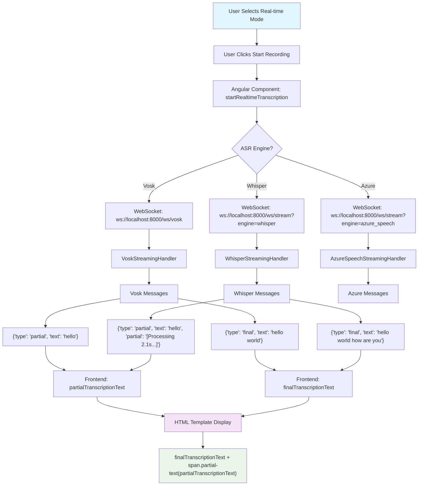

# 📝 Real-time Transcription System Guide

## 🎯 Architecture Overview

The transcript component is a **single, unified display system** that works with both Vosk and Whisper through different WebSocket endpoints and message formats, but presents the transcription in the same visual interface.

## 🔧 System Flow Diagram



## 🔧 Core Components

### 1. HTML Template Structure

The main transcription display uses a unified template that works with both engines:

```html
<div class="transcription-display" [class.recording]="isRecording">
  <div class="recording-indicator" *ngIf="isRecording">
    <div class="recording-dot"></div>
    RECORDING - <span>{{recordingTime}}</span>
  </div>
  <div class="transcription-text">
    <span *ngIf="finalTranscriptionText || partialTranscriptionText; else placeholder">
      {{finalTranscriptionText}}<span class="partial-text">{{partialTranscriptionText}}</span>
    </span>
    <ng-template #placeholder>
      <span class="placeholder-text" *ngIf="isRecording && recordingMode === 'realtime'">
        Listening for speech...
      </span>
      <span class="placeholder-text" *ngIf="!isRecording || recordingMode !== 'realtime'">
        Real-time transcription will appear here when recording...
      </span>
    </ng-template>
  </div>
  <div class="confidence-low" *ngIf="lowConfidenceWords.length > 0">
    Low confidence words: <span>{{lowConfidenceWords.join(', ')}}</span>
  </div>
</div>
```

### 2. Angular Component Properties

```typescript
// Core transcription state
finalTranscriptionText = '';      // Main transcription text (black)
partialTranscriptionText = '';    // Partial/processing text (gray, italic)
lowConfidenceWords: string[] = []; // Words with low confidence

// Recording state
isRecording = false;
recordingMode = 'traditional';    // 'traditional' or 'realtime'
recordingTime = '00:00';

// WebSocket connection
realtimeSocket?: WebSocket;
audioContext?: AudioContext;
scriptNode?: ScriptProcessorNode;
```

### 3. CSS Styling

```css
.transcription-display {
  background: #f8fafc;
  border: 1px solid var(--border-color);
  border-radius: 8px;
  padding: 24px;
  min-height: 200px;
  margin: 24px 0;
  position: relative;
  overflow: hidden;
}

.transcription-display.recording {
  border-color: var(--danger-color);
  animation: pulse 2s infinite;
}

.transcription-text {
  font-size: 16px;
  line-height: 1.8;
  color: var(--text-primary);    /* Black text for final */
}

.partial-text {
  color: var(--text-secondary);  /* Gray text for partial */
  font-style: italic;            /* Italic styling */
}

.recording-indicator {
  display: flex;
  align-items: center;
  gap: 8px;
  color: var(--danger-color);
  font-weight: 600;
  margin-bottom: 16px;
}

.recording-dot {
  width: 12px;
  height: 12px;
  background: var(--danger-color);
  border-radius: 50%;
  animation: blink 1.5s infinite;
}
```

## 🔄 Real-time Flow Differences

### 🎤 Vosk Real-time Transcription

**WebSocket Endpoint**: `ws://localhost:8000/ws/vosk?model=default`

**Backend Handler**: `VoskStreamingHandler`

**Message Flow**:
1. **Partial Messages**: 
   ```json
   {"type": "partial", "text": "hello wo"}
   ```
   - Shows individual words as they're being recognized
   - Updates `partialTranscriptionText` in real-time
   - Appears as gray, italic text

2. **Final Messages**: 
   ```json
   {"type": "final", "text": "hello world", "result": [...]}
   ```
   - Confirms completed phrases/sentences
   - Appends to `finalTranscriptionText`
   - Clears `partialTranscriptionText`
   - Appears as black, normal text

**Characteristics**:
- ✅ **Ultra-low latency**: ~100ms per word
- ✅ **Immediate feedback**: See words as you speak
- ✅ **Lightweight**: Minimal memory usage
- ⚠️ **Accuracy**: Good for individual words, may miss context

### 🤖 Whisper Real-time Transcription

**WebSocket Endpoint**: `ws://localhost:8000/ws/stream?engine=whisper`

**Backend Handler**: `WhisperStreamingHandler`

**Message Flow**:
1. **Buffering Phase**: 
   ```json
   {"type": "partial", "text": "hello", "partial": "[Processing 2.1s of audio...]"}
   ```
   - Shows processing status while accumulating audio
   - Updates `partialTranscriptionText` with status message
   - Processes every 1.5 seconds

2. **Transcription Phase**: 
   ```json
   {"type": "final", "text": "hello world how are you today"}
   ```
   - Processes accumulated audio buffer (1.5-6 seconds of context)
   - Replaces entire `finalTranscriptionText` with new result
   - Provides context-aware, more accurate transcriptions

**Characteristics**:
- ✅ **High accuracy**: Better understanding of context and phrases
- ✅ **Smart buffering**: Maintains 6 seconds of audio context
- ✅ **Memory management**: Automatic cleanup of old segments
- ⚠️ **Latency**: 1.5-second chunks (much better than original 3+ seconds)

## 🎨 Visual Presentation

### Live Display Format:
```
[Final Text: Black, Normal] [Partial Text: Gray, Italic]
"Hello world" "how are..."
```

### Recording States:

**Idle State**:
```
┌─────────────────────────────────────┐
│ Real-time transcription will appear │
│ here when recording...              │
└─────────────────────────────────────┘
```

**Recording State (Vosk)**:
```
┌─────────────────────────────────────┐
│ 🔴 RECORDING - 01:23               │
│                                     │
│ Hello world how are you             │
│                                     │
└─────────────────────────────────────┘
  ↑ Red pulsing border
```

**Recording State (Whisper)**:
```
┌─────────────────────────────────────┐
│ 🔴 RECORDING - 01:23               │
│                                     │
│ Hello world [Processing 2.1s...]   │
│                                     │
└─────────────────────────────────────┘
  ↑ Red pulsing border
```

## ⚡ Message Handling Logic

### Frontend WebSocket Handler

```typescript
this.realtimeSocket.onmessage = ({ data }) => {
  const msg = JSON.parse(data);
  console.log('WebSocket message received:', msg);
  
  // Handle Vosk-style messages (type-based)
  if (msg.type === 'partial') {
    this.partialTranscriptionText = msg.text;
    this.cdr.detectChanges(); // Force UI update
  }
  else if (msg.type === 'final') {
    if (msg.text) {
      this.finalTranscriptionText += (this.finalTranscriptionText ? ' ' : '') + msg.text;
      this.cdr.detectChanges();
      
      // Handle low confidence words for Vosk
      if (msg.result && msg.result.length > 0) {
        const lowConfWords = msg.result
          .filter((word: any) => word.conf && word.conf < 0.8)
          .map((word: any) => word.word);
        if (lowConfWords.length > 0) {
          this.lowConfidenceWords = [...new Set([...this.lowConfidenceWords, ...lowConfWords])];
        }
      }
    }
    this.partialTranscriptionText = '';
  }
};
```

### Audio Processing Pipeline

```typescript
// Convert browser audio to 16-bit PCM for WebSocket
this.scriptNode.onaudioprocess = (event) => {
  if (!this.isRecording || !this.realtimeSocket || this.realtimeSocket.readyState !== WebSocket.OPEN) {
    return;
  }

  const input = event.inputBuffer.getChannelData(0);
  const buffer = new ArrayBuffer(input.length * 2);
  const view = new DataView(buffer);
  
  for (let i = 0; i < input.length; i++) {
    const s = Math.max(-1, Math.min(1, input[i]));
    view.setInt16(i * 2, s < 0 ? s * 0x8000 : s * 0x7FFF, true);
  }
  
  this.realtimeSocket.send(buffer);
};
```

## 🔄 Post-Recording Processing

When recording stops in real-time mode:

1. **Transfer**: `finalTranscriptionText` → `rawTranscription`
2. **Pipeline**: 
   - Cleaning → Remove filler words, normalize text
   - Speaker Diarization → Simulate doctor/patient dialogue
   - Note Generation → Create structured medical note
3. **Results**: Display in standard results boxes below

```typescript
stopRecording() {
  // ... cleanup WebSocket and audio resources ...
  
  if (this.recordingMode === 'realtime' && this.finalTranscriptionText) {
    // Transfer real-time transcription to main transcription
    this.rawTranscription = this.finalTranscriptionText;
    this.showResults = true;
    
    // Process through full pipeline
    this.processRealtimeTranscription();
  }
}
```

## 🎯 Engine Comparison

| Aspect | Vosk | Whisper |
|--------|------|---------|
| **Update Frequency** | Every word (~100ms) | Every 1.5 seconds |
| **Accuracy** | Good for individual words | Better for phrases/context |
| **Latency** | Ultra-low | Low (1.5s chunks) |
| **Partial Display** | Actual partial words | Processing status |
| **Memory Usage** | Minimal | Managed with sliding window |
| **Model Size** | ~50MB | ~150MB |
| **CPU Usage** | Low | Medium |
| **Best For** | Real-time feedback | Accurate transcription |
| **Language Support** | Limited models | Multilingual |

## 🛠️ Technical Implementation Details

### Backend Streaming Handlers

**Vosk Handler** (`src/asr/streaming/handlers.py`):
```python
@dataclass
class VoskStreamingHandler:
    def __call__(self, chunk: bytes) -> None:
        if self.rec.AcceptWaveform(chunk):
            result = json.loads(self.rec.Result())
            final_text = result.get("text", "").strip()
            if final_text:
                self.update_queue.put({
                    "text": " ".join(self.transcriptions),
                    "words_info": result.get("result", []),
                    "is_final": True,
                    "elapsed": elapsed_str,
                    "partial": "",
                })
        else:
            partial_result = json.loads(self.rec.PartialResult())
            partial = partial_result.get("partial", "").strip()
            if partial:
                self.update_queue.put({
                    "text": " ".join(self.transcriptions),
                    "partial": partial,
                    "is_final": False,
                })
```

**Whisper Handler** (`src/asr/streaming/handlers.py`):
```python
@dataclass
class WhisperStreamingHandler:
    processing_interval: float = 1.5  # Process every 1.5 seconds
    window_duration: float = 6.0      # Keep 6 seconds of audio context
    
    def __call__(self, chunk: bytes) -> None:
        self.buf.append(chunk)
        
        if time.time() - self.last_time < self.processing_interval:
            # Show processing status
            audio_seconds = total_bytes / (audio_cfg["rate"] * 2)
            partial_text = f"[Processing {audio_seconds:.1f}s of audio...]"
            self.update_queue.put({
                "type": "partial",
                "text": " ".join(self.segments),
                "partial": partial_text,
            })
        else:
            # Process accumulated audio
            audio_buffer = b"".join(self.buf)
            audio_np = np.frombuffer(audio_buffer, dtype=np.int16).astype(np.float32) / 32768.0
            result = self.model.transcribe(audio_np, language="en")
            
            if result.get("text"):
                self.segments.append(result["text"].strip())
                self.update_queue.put({
                    "type": "final",
                    "text": " ".join(self.segments),
                })
```

### WebSocket Routing

**Vosk Endpoint** (`src/asr/streaming/websocket.py`):
- Direct connection to pre-loaded Vosk model
- Immediate processing of audio chunks
- Word-level confidence scoring

**Generic Streaming Endpoint** (`backend/routers/streaming_ws.py`):
- Routes to different engines via query parameter
- Session-based management
- Resource monitoring and cleanup

## 🚀 Performance Optimizations

### Vosk Optimizations:
- **Model Pre-loading**: Avoids startup delay during WebSocket connection
- **Minimal Memory**: Processes chunks immediately without buffering
- **Confidence Filtering**: Highlights low-confidence words for review

### Whisper Optimizations:
- **Sliding Window**: Maintains context while preventing memory growth
- **Segment Management**: Keeps only last 8 segments to prevent unbounded growth
- **Processing Intervals**: Reduced from 3s to 1.5s for better responsiveness
- **Buffer Management**: Limits audio buffer to 6 seconds of context

## 🔧 Configuration Options

### Frontend Configuration:
```typescript
config: Config = {
  asrEngine: 'vosk',           // 'vosk' | 'whisper' | 'azure'
  voskModel: 'vosk-model-en-us-0.22',
  whisperModel: 'tiny',        // 'tiny' | 'base' | 'small' | 'medium' | 'large'
  // ... other settings
};
```

### Backend Configuration:
- **Vosk**: Model path configuration via environment variables
- **Whisper**: Model size selection and processing intervals
- **Audio**: Sample rate (16kHz), chunk size (1024), channels (1)

## 🎯 Key Benefits

1. **Unified Interface**: Same UI works with different engines
2. **Engine-Specific Optimization**: Each engine optimized for its strengths
3. **Real-time Feedback**: Visual indicators and live transcription
4. **Memory Management**: Automatic cleanup and resource monitoring
5. **Extensible**: Easy to add new ASR engines
6. **Production Ready**: Error handling, reconnection, and resource cleanup

## 🛡️ Error Handling

- **WebSocket Disconnection**: Automatic cleanup of audio resources
- **Model Loading Errors**: Graceful fallback with user notification
- **Audio Processing Errors**: Continue with available transcription
- **Memory Management**: Automatic buffer cleanup and segment pruning

This architecture provides a robust, scalable real-time transcription system that can accommodate different ASR engines while providing a consistent user experience. 