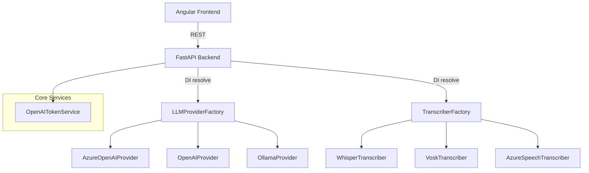

# Architecture Overview

The application follows a **provider-first** architecture.

### Key Principles
* **No business code imports SDKs directly** – always go through a provider.
* **Factories + DI container** give runtime flexibility.
* **Token management** centralized under `ITokenService`. 